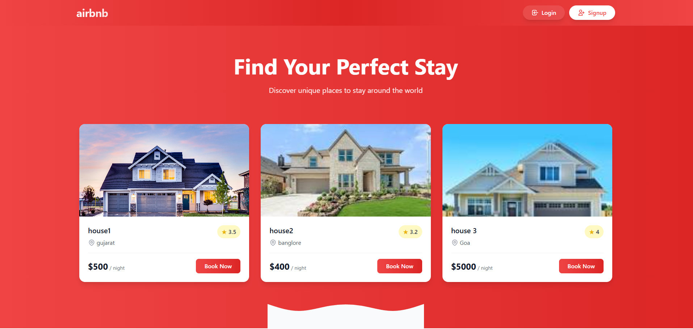
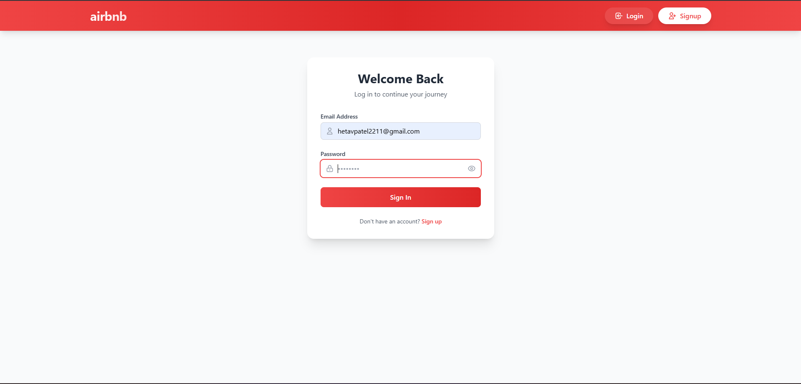
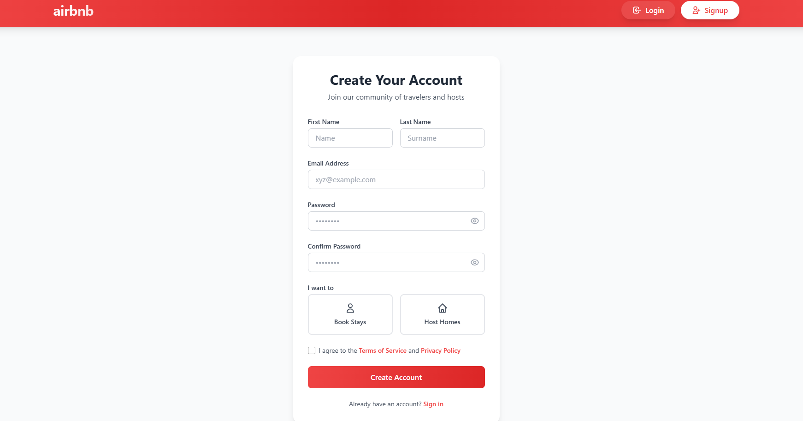
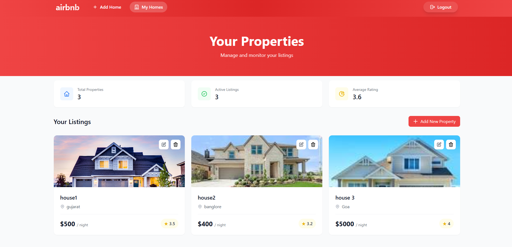
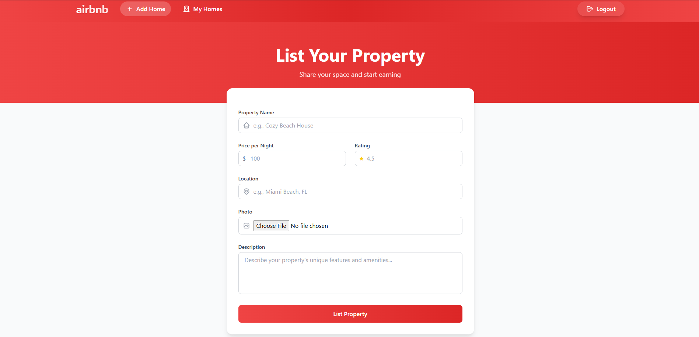

# 🏠 Airbnb Clone

<div align="center">
  
  
  
  
  
  
  
</div>

## 🌍 **About**

A full-stack property rental platform inspired by Airbnb. Users can browse properties, make bookings, and hosts can list their spaces. Built with modern web technologies and responsive design.

---

## ✨ **Key Features**

### **Property Browsing**
<div align="center">
  
</div>

- 🏠 Browse available properties
- 📱 Responsive grid layout

### **Booking System**

### **Login Page**
<div align="center">
  
</div>

### **Signup Page**
<div align="center">
  
</div>


### **Host Dashboard**
<div align="center">
  
</div>

### **Add Home**
<div align="center">
  
</div>

- ➕ Add new properties
- 📊 Booking management

---

## 🛠️ **Tech Stack**

### **Frontend**
- Ejs
- Tailwind


### **Backend**
- Node.js
- Express.js
- MongoDB
- Becrypt
- Multer

---

## 🚀 **Installation**

### **Prerequisites**
- Node.js (v14+)
- MongoDB
- npm/yarn

### **Setup**

1. **Clone repository**
   ```bash
   git clone https://github.com/Hetav2211/Airbnb-Clone.git
   cd Airbnb-Clone
